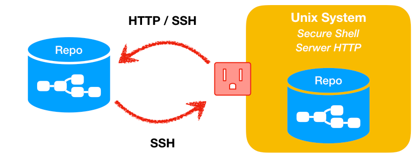
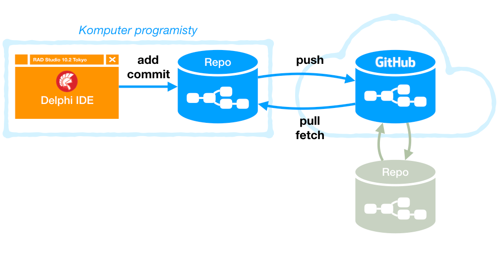

# Repozytorium Git-a

Repozytorium Git-a zawiera zbiór rewizji, które składają się z migawek plików:
* **zbiór rewizji** to zbiór wersji historycznych zarejestrowanych plików, 
* rewizja = zbiór migawek
* migawka piku to pełna kopia danego pliku (nie jest to delta zmian!)

Zbiór migawek w danej rewizji zawiera:
* pełne kopie plików, które zostały zmienione oraz wszystkie nowe pliki 
* wskaźniki do wcześniejszej migawki plików, które nie uległy zmianie

W efekcie system Git ma możliwość natychmiastowego dostępu do dowolnej wersji repozytorium. O wiele prostsze staje się również rozgałęzianie i scalanie różnych wersji plików. Git można traktować jako bardzo wydajny systemem plików z możliwością optymalnego zapamiętania ich wcześniejszych wersji. Systemy wersjonowania kodu starszej generacji (takie jak Subversion i CVS) mają o wiele gorszą wydajność oraz są dużo trudniejsze i bardziej kłopotliwe w zarządzaniu.

# Struktura rewizji

**Identyfikator**. Rewizja jest jest unikalnie identyfikowana 40 znakowym kodem SHA-1 (20 bajtów zapisanych heksadecymalnie). Unikalność identyfikatora rewizji jest zapewniona nie tylko w ramach lokalnego repozytorium, ale również globalnie w ramach wielu repozytoriów. Dla łatwiejszego odwoływania się do rewizji w praktyce stosuje się 7-znakowy skrót (pierwsze 7 znaków z 40 znakowego skrótu SHA-1).


**Struktura**. Każda rewizja połączona jest z poprzednią wersją, a dokładniej to *nowsza* wersja wskazuje *starszą*. W efekcie możliwe jest aby jedna *starsza* rewizja była wskazywana równocześnie przez kilka *nowszych* rewizji. Taką sytuację nazywa się rozgałęzieniem.

Poza połączaniami rewizji strukturę budują również wskaźniki Git-a. Jest ich kilka rodzajów:

* **głowa (HEAD)** - aktualnie widoczna w katalogu roboczym rewizja. Głowa może wskazywać dowolną gałąź lub bezpośrednio którąś z rewizji. Każda zmiana (commit) powoduje utworzenie nowej rewizji i przesuniecie głowy

* **gałąź (branch)** - nazwany wskaźnik, który wskazuje dowolną rewizję w repozytorium. Gałąź aktualna to taka, którą wskazuje głowa. Przełączanie się miedzy gałęziami powoduje również aktualizację plików w katalogu roboczym. Jeśli głowa (HEAD) wskazuję gałąź to w momencie zmiany przesuwany jest ten wskaźnik gałęzi na nowo powstałą rewizję. Głowa nadal wskazuje na tą gałąź, czyli pośrednio zostanie "przesunięta".

* **gałąź główna (master)** - tworząc nowe repozytorium, automatycznie tworzona jest gałąź główna o nazwie master. Zazwyczaj wskazuje na aktualną zatwierdzoną wersję wersjonowanych dokumentów.

* **etykieta (tag)** - nazwany wskaźnik rewizji, w odróżnieniu od gałęzi nie przesuwa się w momencie wprowadzenia zmian, czyli stale wskazuje wybraną rewizję. Można ja wykorzystać to wskazania numeru wersji projektu.


# Zdalne repozytorium

Git jest rozproszonym systemem wersjonowania kodu źródłowego, czyli programista zazwyczaj korzysta ze swojej własnej kopii repozytorium głównego. Lokalne repozytorium jest w pełni autonomiczną kopią repozytorium Git-a. Dzięki takiemu rozwiązaniu możliwe jest zatwierdzanie zmian bez połączenia sieciowego (sieć lokalna lub sieć Internet). 




Repozytorium lokalne tworzone jest na dwa sposoby: 
* poleceniem ```git init``` - powstaje puste repozytorium w katalogu, w którym wydano takie polecenie.
* poleceniem ```git clone [adres_repozytorium_zdalnego]``` - tworzone jest nowe repozytorium będące kopią zdalnego, w takiej sytuacji adres do repozytorium zdalnego zapamiętywany jest po skrótem, nazwanym domyślnie ```origin```.

Zmiany umieszczone w repozytorium lokalnym można w każdym momencie zsynchronizować z repozytorium zdalnym wydając poleceni ```git push```

Sprawdzenie listy zarejestrowanych zdalnych repozytoriów:

```sh
$ git remote -v

origin	https://github.com/bogdanpolak/MARS.git (fetch)
origin	https://github.com/bogdanpolak/MARS.git (push)
upstream	https://github.com/andrea-magni/MARS.git (fetch)
upstream	https://github.com/andrea-magni/MARS.git (push)
```

Rejestracja repozytorium:

```sh
$ git remote add xstream https://github.com/andrea-magni/MARS.git
```

# RAD Studio i GitHub



Środowisko RAD Studio (Delphi i C++Builder) zawiera integrację z Git-em nazywaną VersionInsight. Rozszerzenie to pozwala na przeglądanie zmian oraz wydawanie kilku najprostszych poleceń git-a bezpośrednio ze środowiska IDE. W praktyce najlepiej sprawdza się w czasie rejestrowania zmian oraz dodawania plików do repozytorium lokalnego (polecenie `git add` i `git commit`).

Aby zacząć korzystać z tej integracji w RAD Studio konieczna jest konfiguracji opcji VersionInsight:


# Symulatory Git-a

Dwa przykłady z wielu (wystarczy poszukać):

1. Symulator z zadaniami oraz z wizualizacją w formie grafu
  * [Learning Git Branching](https://learngitbranching.js.org)
  * Ciekawe zadania pozwalające głębiej poznać pracę z gałęziami w Git-cie
  * Zadania w języku angielskim
  
2. Fajna wizualizacja na grafie do własnych eksperymentów
  * [Visualizing Git](http://git-school.github.io/visualizing-git/)
  * Dokładne odwzorowanie rewizji w Git-cie
  * Symulacja repozytorium lokalnego i zdalnego (origin)
